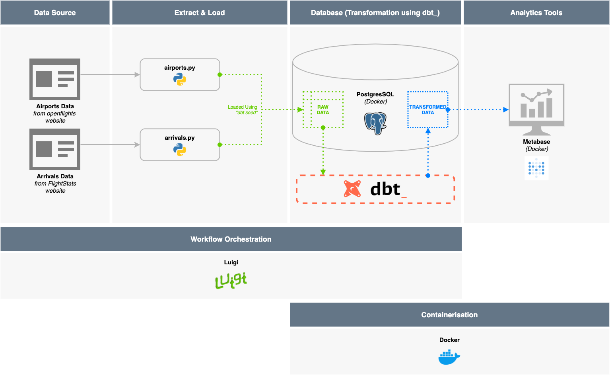
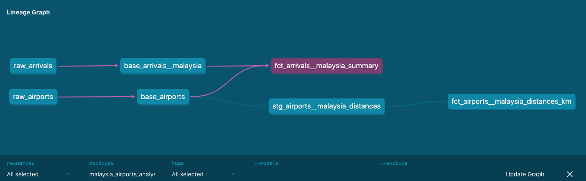
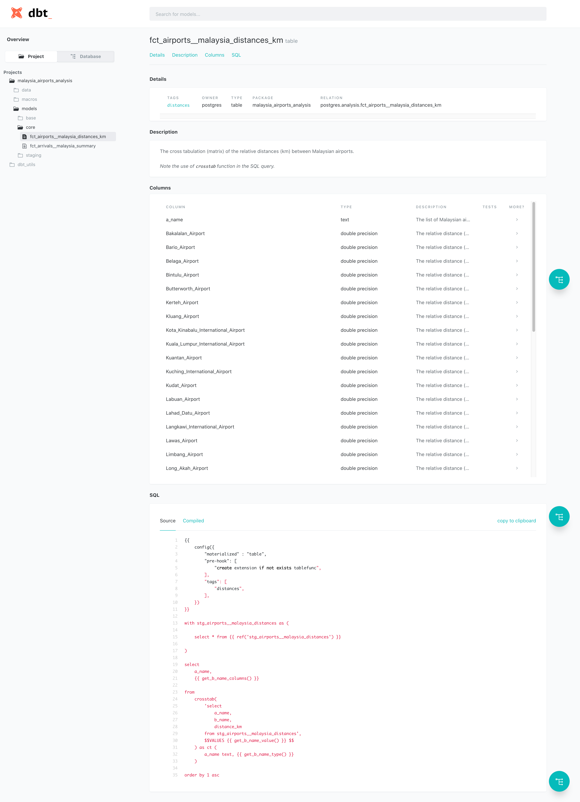
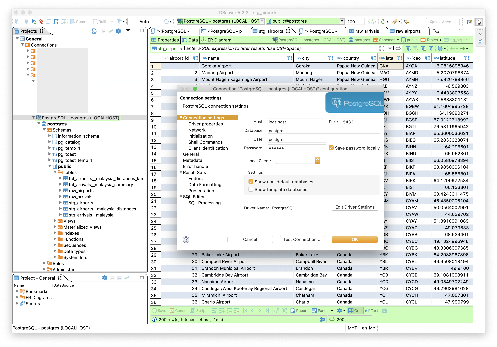
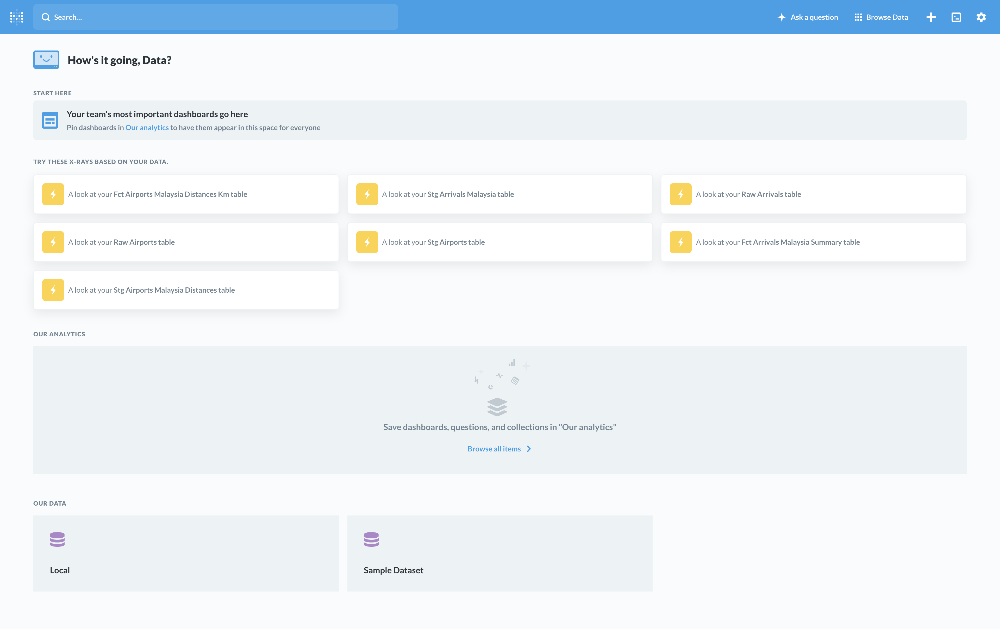

Simple Airports Analysis - Malaysia
==================================


## Contents
- [Introduction](#introduction)
    - [Project Framework](#project-framework)
    - [Table Lineage (via dbt)](#table-lineage-via-dbt)
    - [Table Documentation (via dbt)](#table-documentation-via-dbt)
    - [Metabase Dashboard](#metabase-dashboard)
- [Technology Used](#technology-used)
    - [Developer Notes](#developer-notes)
- [Requirements](#requirements)
- [Data Source](#data-source)
- [Using this project](#using-this-project)
    - [Step 1. Initial setup](#step-1-initial-setup)
    - [Step 2. Running the workflow](#step-2-running-the-workflow)
        - Alternatively, to [run tasks manually](docs/run_tasks_manually.md) _(i.e. without using Luigi)_
        - Optionally, to [replicate Luigi's web visualisation](docs/visualising-luigi.md)
    - [Step 3. Analysis on Metabase](#step-3-analysis-on-metabase) _(Optional)_
    - [Step 4. Viewing dbt documentation](#step-4-viewing-dbt-documentation) _(Optional)_
    - [Step 5. Done](#step-5-done)
- [Suggested Improvements](#suggested-improvements)
- [Author](#author)


## Introduction
In this project, we want to run simple analysis on airport and arrival data. 

We want to answer these simple questions:
1. How many airports are there in Malaysia?
2. What is the distance between the airports in Malaysia?
3. How many flights are going to land in Malaysian airports the next day from the point of query?
4. Which airport is most congested base on the information gathered in question 3 above?

To answer these questions, we built an end-to-end framework with ETL pipelines, database, and analytics platform 
as seen in [Project Framework](#project-framework) diagram below. _(Admittedly a little over-engineered but, hey! Why not...? :trollface:)_


### Project Framework
Covered in Step 1, 2, and 3


### Table Lineage (via dbt)
Covered in Step 4 _**(Optional)**_


### Table Documentation (via dbt)
Covered in Step 4 _**(Optional)**_


### Metabase Dashboard
Covered in Step 3 _**(Optional)**_


## Technology Used
| **Database**              | **(ETL) Pipeline**          | **Workflow Orchestration** | **Analytics Platform**    |
|---------------------------|-----------------------------|----------------------------|---------------------------|
| Postgres _(using Docker)_ | Python 3.6                  | Luigi _(using Python)_     | Metabase _(using Docker)_ |
|                           | dbt _(Data Transformation)_ |                            |                           |

#### Developer notes
This project was created on macOS. It has not yet been tested on Windows.


## Requirements

- [Python](https://www.python.org/downloads/) 3.6 or above
    1. _(Optional)_ Use a virtual environment - see [this guide](https://docs.python-guide.org/dev/virtualenvs/)
    2. **_`IMPORTANT`_** - For libraries used, see `requirements.txt`. Includes:
        - [luigi](https://pypi.org/project/luigi/) - Workflow Orchestration
        - [dbt](https://docs.getdbt.com/docs/installation#section-pip) - data build tool _(Data Transformation)_

- [Docker](https://www.docker.com/products/docker-desktop)
    1. [PostgresSQL](https://hackernoon.com/dont-install-postgres-docker-pull-postgres-bee20e200198) - Database
    2. [Metabase](https://www.metabase.com/docs/latest/operations-guide/running-metabase-on-docker.html) - Analytics Platform

- Other Software
    1. [DBeaver](https://dbeaver.io/download/) - SQL Client to view the database


## Data Source
We primarily use Airport and Arrival data from these two sources:
- Airport Data
    - https://raw.githubusercontent.com/jpatokal/openflights/master/data/airports.dat
- Arrival Data
    - https://www.flightstats.com/v2/flight-tracker/search
        - Specifically, we will scrape arrival information by looping through this site for each airport 
        - Example link scraped: https://www.flightstats.com/v2/flight-tracker/arrivals/KUL/?year=2020&month=2&date=18&hour=6


## Using this project

### Step 1. Initial setup
1) Install Python 3.6 using [these instructions](https://www.python.org/downloads/).
   > _(Optional) Use a [Python virtual environment](https://docs.python-guide.org/dev/virtualenvs/)_

2) **_`IMPORTANT`_** - Install required libraries:
    ```bash
    $ pip install -r requirements.txt
    ```
   This will install the Python libraries required for this project:
   - [x] `luigi` - for (one-script) workflow orchestration
   - [x] `dbt` - for uploading raw data and data transformation in database
   - [x] `requests` - to scrape websites
   - [x] `SQLAlchemy` - for database connection in scripts
   - [x] `pandas` - for flattening of extracted (JSON) data and saving to csv 
   - [x] `PyYAML` - for configuration extraction

3) Install Docker using [these instructions](https://www.docker.com/products/docker-desktop).

4) Install PostgresSQL via Docker using the instructions below _([source](https://hackernoon.com/dont-install-postgres-docker-pull-postgres-bee20e200198))_:
    ```bash
    $ docker pull postgres
    
    $ mkdir -p $HOME/docker/volumes/postgres
    
    $ docker run --rm --name pg-docker -e POSTGRES_PASSWORD=docker -d -p 5432:5432 -v $HOME/docker/volumes/postgres:/var/lib/postgresql/data postgres
    ```

5) Install a suitable SQL Client such as [DBeaver](https://dbeaver.io/download/).
    
    Use the default connection configuration to verify the database connection and view the data that will be added in the later steps.
    ```yaml
    Host:     localhost 
    Database: postgres
    Port:     5432
    User:     postgres
    Password: docker
    ```
    
    


### Step 2. Running the workflow
> _This step utilises the Luigi workflow orchestration. To run each tasks in the workflow manually, see [this guide](docs/run_tasks_manually.md)._
1) Run the `workflow.py` file which will initiate the luigi workflow orchestration
    ```bash
    $ python workflow.py --local-scheduler DbtRunAnalysis 
    ```
    > _Notes: This step may take some time since it is running the entire pipeline._
  
    Luigi will work through all the steps as defined in `workflow.py`. 
    > _(Optional) Luigi has a web interface which can be used to monitor workflow and view dependency graphs as shown below. To replicate, follow [this guide](docs/visualising-luigi.md)._ 

    

2) The following will be returned when the previous step completed successfully:
    ```bash
    INFO: 
    ===== Luigi Execution Summary =====
    
    Scheduled 7 tasks of which:
    * 7 ran successfully:
        - 1 DbtDeps()
        - 1 DbtRunAirports()
        - 1 DbtRunAnalysis()
        - 1 DbtSeedAirports()
        - 1 DbtSeedArrivals()
        ...
    
    This progress looks :) because there were no failed tasks or missing dependencies
    
    ===== Luigi Execution Summary =====
    ```
    > _Notes: You can view the 'logs' for each step in the files with `.output` extensions._

3) The data should ready in the database as tables and can be viewed using the SQL Client that was installed in 
    [Step 1.5](#step-1-initial-setup) above. 


### Step 3. Analysis on Metabase
> _**Optional Step!** Alternatively, the data can be viewed directly using the SQL client as mentioned in [Step 1.5](#step-1-initial-setup)._

1) Install Metabase via Docker using the instructions below _([source](https://www.metabase.com/docs/latest/operations-guide/running-metabase-on-docker.html))_:
    ```bash
    $ docker run -d -p 3000:3000 --name metabase metabase/metabase
    ```
   > _Wait for a little while as it takes time to initialise. You can use `docker logs -f metabase` to follow the rest of the initialization progress._ 

2) Once initialised, visit the local Metabase portal at [http://localhost:3000/](http://localhost:3000/)

3) You will be directed to `http://localhost:3000/setup`, click on `Let's get started`:
    

4) Fill in the details for your admin account:
    

5) **Important step** - Use the following database connection configuration to connect Metabase to our Postgres instance in Docker:
    ```yaml
    Name: Local  (Or any other name) 
    Host: host.docker.internal 
    Port: 5432
    Database name: postgres
    Database username: postgres
    Database password: docker
    ```
    > Please note that this has been tested to work on macOS. For Windows, if Metabase fails to connect to the above `Host`, please try referring to this [official documentation on Docker Networking](https://docs.docker.com/docker-for-windows/networking/).

    

6) Choose your usage data preference:
    

7) **Done!** You should see the main Metabase page below which lists the available tables in the Postgres Database that was created in [Step 2](#step-2-running-the-workflow).
    

8) Unfortunately, there is no export feature to share the [dashboard and charts](#metabase-dashboard) 
    seen in the [Introduction](#introduction). However, it is just a few simple `SELECT * FROM table` queries to the 
    main `fct_` and some of the `stg_` tables available in the Postgres database. :smile:


### Step 4. Viewing dbt documentation
> _**Optional Step!**_

1) In the `./dbt` directory, run the following commands to generate the documentation:
    ```bash
    $ cd ./dbt
    $ dbt docs generate --profiles-dir ./
    ```

2) Once the documentation has been generated, run the following commands to host the documentation website locally:
    ```bash
    $ dbt docs serve
    ```
   
3) The documentation website should automatically be launched in your browser. 
    
    If it does not, just navigate to [http://localhost:8080/](http://localhost:8080/).


### Step 5. Done 
:shipit:


## Suggested Improvements
As this project was only done in more or less 3 days, there were some features or improvements that were not implemented.

Here are a few suggestions:
- **Use multiprocessing to scrape websites** - Especially for arrivals data.
- **Implement the logging module** - Right now, the scripts are using simple print statements. Proper logging will help with debugging.
- **Data documentation using dbt** - Documentation is important, but it is also a time consuming task.
- **Use environmental variables for sensitive info** - In particular, passwords. 
- **Use a more versatile Workflow Orchestration tool** - Luigi is simple and easy to get started. But should consider something like Airflow for more complex workflow and more features. 


## Author
- **Lee Boon Keong** - _Feb, 2020_ 
