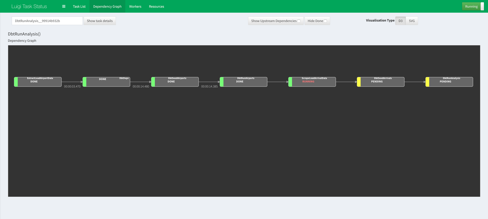

Running tasks manually
======================

## Context
Instead of using the one script (`workflow.py`) that executes the Luigi Workflow Orchestration as shown in 
[Step 2](../README.md#step-2-running-the-workflow) of the main [README.md](../README.md), 
this documentation will break down the tasks in the script so that it can be run individually and manually.



## Running Luigi tasks manually

### Step 1. ExtractLoadAirportData
- Execute python script to extract airport data from website link and load into database:
    ```bash
    # In the root of project directory:  
    $  python ./extract_load/airports.py
    ```

### Step 2. DbtDeps
- Install the dbt dependencies:
    ```bash
    # If not in the dbt directory:  
    $ cd ./dbt/
   
    # In the ./dbt directory:  
    $ dbt deps
    ```
    Specifically, we will be using macros from [dbt_util](https://github.com/fishtown-analytics/dbt-utils) in our 
    [custom macros](../dbt/macros/core/distance.sql) that are ultimately used in the 
    [SQL queries](../dbt/models/core/fct_airports__malaysia_distances_km.sql) to forms our 
    [final analytics tables](../README.md#table-lineage-via-dbt).
    
### Step 3. DbtSeedAirports
- Use dbt to easily seed CSV files stored locally:
    ```bash
    # In the ./dbt directory:  
    $ dbt seed --profiles-dir ./
    ```
    This alternative to using SQL Alchemy in Python scripts to upload to the databases.

    In this step, dbt will upload the `./dbt/data/raw_airports.csv` to the database.

### Step 4. DbtRunAirports
- Run dbt that cleans the Airport data to be used in later steps to scrape arrival data (using airport iata/icao code):
    ```bash
    # In the ./dbt directory:  
    $ dbt run --profiles-dir ./ --model tag:cleaned_airports
    ```
    In this step, dbt will compile and execute the SQL Query to create:
    - [base_airports](../dbt/models/base/base_airports.sql) table. 

### Step 5. ScrapeLoadArrivalData
- Execute python script to extract arrival data from website link and load into database:
    ```bash
    # In the root of project directory:  
    $ python ./extract_load/arrivals.py
    ```
    The script in this step will query the table in the database created in [Step 2.4](#step-4-dbtrunairports) above 
    to obtain the airport codes (iata/icao) and use them to loop through the arrival data website. 
    > Note: 

### Step 6. DbtSeedArrivals
- Use dbt to easily seed CSV files stored locally:
    ```bash
    # In the ./dbt directory:  
    $ dbt seed --profiles-dir ./
    ```
    In this step, dbt will upload the `./dbt/data/raw_arrivals.csv` to the database.

### Step 7. DbtRunAnalysis
- Run dbt that cleans the Arrival data and Transform the tables to its Factual Tables for analytics:
    ```bash
    # In the ./dbt directory:  
    $ dbt run --profiles-dir ./ --exclude tag:cleaned_airports
    ```
    In this step, dbt will compile and execute the SQL Query to create:
    - [base_arrivals__malaysia](../dbt/models/base/base_arrivals__malaysia.sql) table. 
    - [stg_airports__malaysia_distances](../dbt/models/staging/stg_airports__malaysia_distances.sql) table. 
    - [fct_airports__malaysia_distances_km](../dbt/models/core/fct_airports__malaysia_distances_km.sql) table. 
    - [fct_arrivals__malaysia_summary](../dbt/models/core/fct_arrivals__malaysia_summary.sql) table. 

