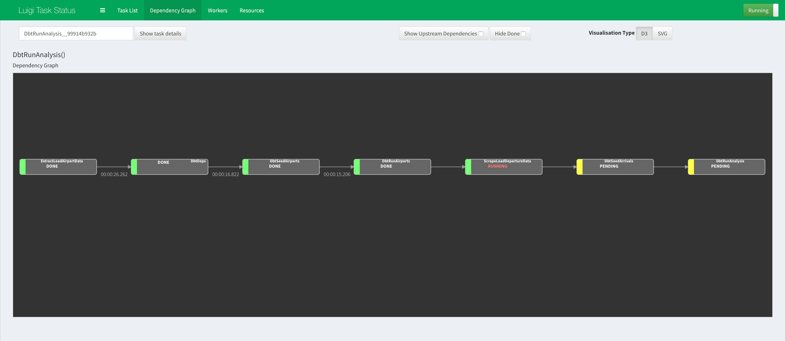

Visualising Luigi Workflow Orchestration
========================================

### Step 1. Start Luigi daemon 
- In a separate terminal session (make sure to enter your virtual env if you have one), start up the Luigi daemon:
    ```bash
    $ luigid
    ```

   
### Step 2. Open the Luigi web visualiser 
- In a browser, go to [http://localhost:8082](http://localhost:8082)

  
### Step 3. Start the Luigi workflow
- Instead of executing the command which uses `--local-scheduler` in the original [Step 2.1](../README.md#step-2-running-the-workflow) 
    in the main [README.md](../README.md), use `--scheduler-host` and specify `localhost`:
    ```bash
    $ python workflow.py --scheduler-host localhost DbtRunAnalysis
    ```


### Step 4. Refresh and view the Luigi web visualiser
- Go back to [http://localhost:8082](http://localhost:8082) in the browser and refresh the website.
- You should be able to navigate around and find the Dependency Graphs for the tasks that are executed. 
    
